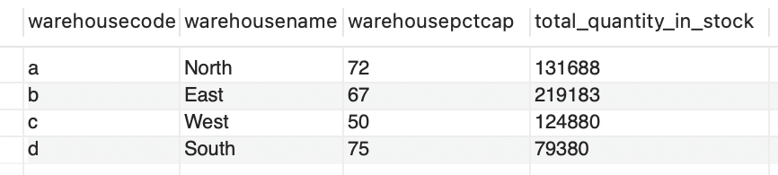
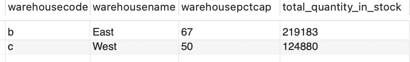
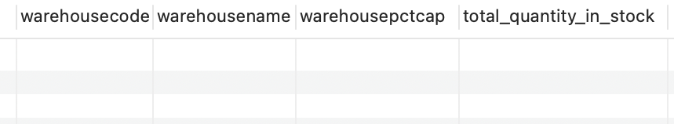

<span style="color:#6495ED; font-size:24px; font-weight:bold;">Mint Classics Data Insights & Warehouse Optimization using SQL</span> <br>
<span style="color:#6495ED; font-size:20px; font-weight:bold;">Author: Linh Khanh Nguyen (Kolor)</span>

--

## Table of contents
1. [Introduction](#introduction)
2. [SQL queries](#meth)
3. [Result Discussions](#section3)
4. [Recommendation for Mint Classics](#summary)

## Introduction  <a name="introduction"></a>

The main goal of this project is to analyze data with the goal of supporting inventory-related business decisions of the fictional Mint Classics Company using SQL. In today's dynamic and data-driven business landscape, understanding and harnessing sales data is crucial for making informed decisions, optimizing operations, and driving profitability. The project at hand involves the extraction and analysis of sales data to gain valuable insights into the performance of Mint Classics. By delving into historical sales records, this project aims to uncover trends, patterns, and key metrics that can inform strategic planning, inventory management, and marketing strategies.

Through the use of SQL queries, we will examine sales data broken down by year and month, providing a granular view of the business's performance over time. This analysis includes metrics such as total orders, total quantity ordered, and total sales revenue, which are essential for evaluating the health and growth of the business.

As we delve into the findings of this project, we will discover not only how the business has performed in the past but also gain insights that can be used to shape its future trajectory. Whether it's identifying peak sales seasons, optimizing inventory levels, or refining marketing campaigns, the knowledge gained from this analysis will empower the business to make data-driven decisions and remain competitive in today's rapidly changing market.

## SQL queries <a name="meth"></a>

Here is some code that I used to develop the analysis. 
 
```sql
SELECT
    p.productcode,
    p.productname,
    p.quantityinstock,
    (SELECT COUNT(*) FROM orderdetails od WHERE p.productcode = od.productcode) AS order_count
FROM
    products p
HAVING
    order_count = 0;
```
Result


<br><br>

```sql
SELECT
    p.productline,
    SUM(p.quantityinstock) AS total_inventory,
    w.warehousecode,
    w.warehousename,
    w.warehousepctcap
FROM
    products p
JOIN
    warehouses w ON p.warehousecode = w.warehousecode
GROUP BY
    p.productline, w.warehousecode, w.warehousename, w.warehousepctcap
ORDER BY
    total_inventory DESC;
```
Result


<br><br>

```sql
SELECT
    YEAR(o.orderdate) AS sales_year,
    MONTH(o.orderdate) AS sales_month,
    COUNT(o.ordernumber) AS total_orders,
    SUM(od.quantityordered) AS total_quantity_ordered,
    SUM(od.quantityordered * od.priceeach) AS total_sales
FROM
    orders o
JOIN
    orderdetails od ON o.ordernumber = od.ordernumber
GROUP BY
    sales_year, sales_month
ORDER BY
    sales_year, sales_month;
```
Result


<br><br>

```sql
SELECT
    p.productline,
    COUNT(*) AS total_products,
    SUM(p.quantityinstock) AS total_inventory,
    AVG(p.buyprice) AS avg_buyprice,
    AVG(p.MSRP) AS avg_msrp
FROM
    products p
GROUP BY
    p.productline
ORDER BY
    total_inventory DESC;
```
Result


<br><br>

```sql
SELECT
    YEAR(paymentdate) AS payment_year,
    MONTH(paymentdate) AS payment_month,
    COUNT(*) AS total_payments,
    SUM(amount) AS total_amount
FROM
    payments
GROUP BY
    payment_year, payment_month
ORDER BY
    payment_year, payment_month;
```
Result


<br><br>

-- Calculate the capacity utilization for each warehouse
```sql
SELECT
    w.warehousecode,
    w.warehousename,
    w.warehousepctcap,
    SUM(p.quantityinstock) AS total_quantity_in_stock
FROM
    warehouses w
JOIN
    products p ON w.warehousecode = p.warehousecode
GROUP BY
    w.warehousecode, w.warehousename, w.warehousepctcap;
```
Result


<br><br>

-- Scenario 1: Check if any warehouse has capacity utilization below 70%
```sql
SELECT
    warehousecode,
    warehousename,
    warehousepctcap,
    total_quantity_in_stock
FROM
    (SELECT
        w.warehousecode,
        w.warehousename,
        w.warehousepctcap,
        SUM(p.quantityinstock) AS total_quantity_in_stock
    FROM
        warehouses w
    JOIN
        products p ON w.warehousecode = p.warehousecode
    GROUP BY
        w.warehousecode, w.warehousename, w.warehousepctcap) AS warehouse_utilization
WHERE
    warehousepctcap < 70;
```
Result


<br><br>

-- Scenario 2: Check if any warehouse has capacity utilization above 90%
```sql
SELECT
    warehousecode,
    warehousename,
    warehousepctcap,
    total_quantity_in_stock
FROM
    (SELECT
        w.warehousecode,
        w.warehousename,
        w.warehousepctcap,
        SUM(p.quantityinstock) AS total_quantity_in_stock
    FROM
        warehouses w
    JOIN
        products p ON w.warehousecode = p.warehousecode
    GROUP BY
        w.warehousecode, w.warehousename, w.warehousepctcap) AS warehouse_utilization
WHERE
    warehousepctcap > 90;
```
Result


<br><br>

## Result Discussion <a name="section3"></a>
First, the analysis identified products that have not been ordered, which is 1985 Toyota Supra. Based on this, Mint Classics should decide to promote it, offer discounts, or even consider discontinuing it if it is still not generating any demand.

Secondly, the analysis showed that the classic car product line has the highest inventory level, while the train product line has the lowest inventory level. It also showed which warehouse each product line is stored at, and the percentage capacity of each warehouse. This information can help the business understand whether certain warehouses are close to their storage limits. Thus, all of the information can be crucial for logistics and optimizing stock distribution. Product lines with high inventory levels (classic car and vintage car) are stored at warehouses that still have a lot of capacity left, while product lines with lower inventory levels are stored at warehouses with lower capacity remaining. The analysis further consolidates that classic car and vintage car product lines have the most number of total products, which suggests these product lines are the most popular and have diversity in their product offerings. The fact that these product lines have high inventory levels shows that Mint Classics can ensure that products are readily available to meet customer demand. This can lead to improved customer satisfaction and loyalty. The warehouses that store inventories of these two product lines also have higher capacity left than other warehouses, indicating that Mint Classics' warehouses operate efficiently and are not overburdened.

Furthermore, the analysis showed that for each product line, the average MSRP (Manufacturer's Suggested Retail Price) is higher than the average buy price. This suggests Mint Classics' business has the potential for good profit margins and pricing flexibility, which can be positive for competitiveness and customer satisfaction. Still, careful pricing strategies and cost management are essential to maintain profitability and market positioning.

## Recommendation for Mint Classics <a name="summary"></a>

First of all, Mint Classics should use the queried sales and payment data and visualize the sales and payment by time to identify peak sales months and seasons from the sales data, adjust inventory levels to meet increased demand during these periods, and consider pre-seasonal ordering to ensure product availability during high-demand periods.

Secondly, Mint Classics should employ product mix optimization by using the queried product lines data. They should evaluate the performance of individual product lines over time, consider discontinuing or repositioning poorly performing product lines, and invest in marketing and inventory management for high-performing product lines.

Furthermore, Mint Classics should implement inventory control and cost management based on the queried inventory and warehouse data. It should implement effective inventory control measures to prevent overstocking and reduce carrying costs, negotiate favorable purchasing terms with suppliers to optimize buy prices, and monitor inventory turnover rates and aim for efficient inventory management.

## More 

To view the GitHub repo for this website, click [here](https://github.com/WilliamRoth82/BozandtheBozzers).
