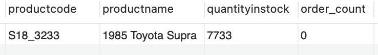
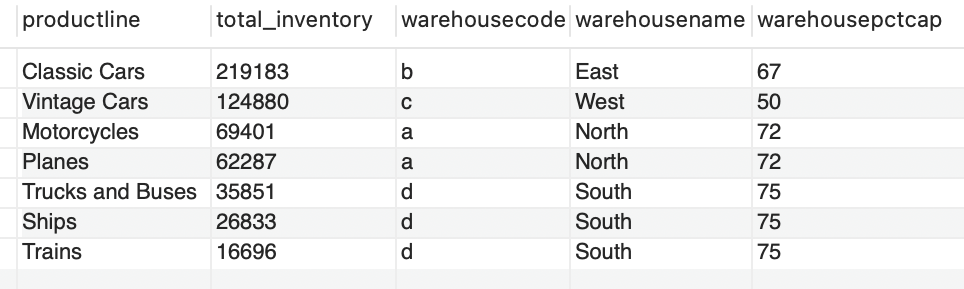
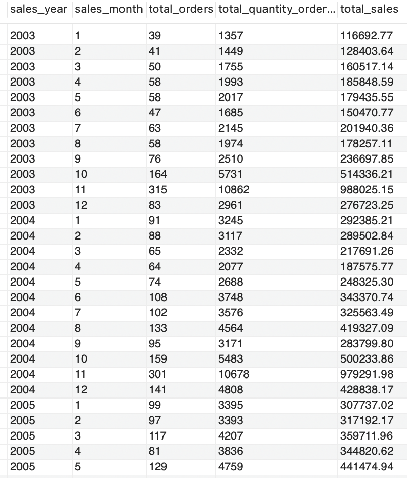
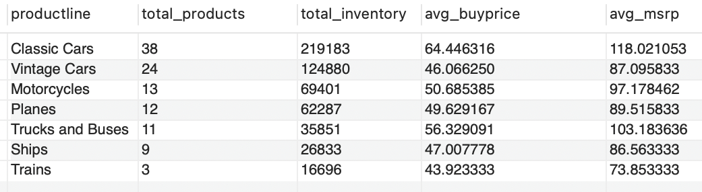
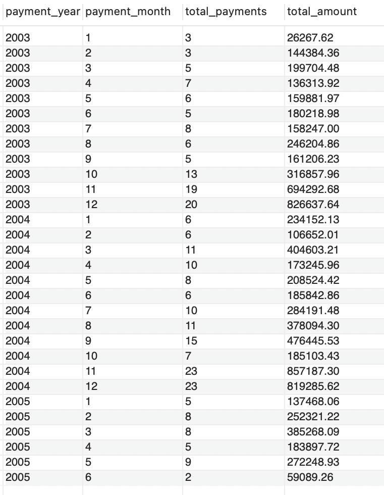

<span style="color:#6495ED; font-size:24px; font-weight:bold;">Mint Classics Data Insights & Warehouse Optimization using SQL</span> <br>
<span style="color:#6495ED; font-size:20px; font-weight:bold;">Author: Linh Khanh Nguyen (Kolor)</span>

--

## Table of contents
1. [Introduction](#introduction)
2. [Methodology](#meth)
3. [Section 2](#section2)
    1. [Subsection](#subsec2-1)
    2. [Subsection](#subsec2-2)
4. [Analysis Section](#section3)
5. [Summary](#summary)

## Introduction  <a name="introduction"></a>

The main goal of this project is to analyze data with the goal of supporting inventory-related business decisions of the fictional Mint Classics Company using SQL. 

## SQL queries <a name="meth"></a>

Here is some code that we used to develop our analysis. 
 
```sql
SELECT
    p.productcode,
    p.productname,
    p.quantityinstock,
    (SELECT COUNT(*) FROM orderdetails od WHERE p.productcode = od.productcode) AS order_count
FROM
    products p
HAVING
    order_count = 0;
```
Result


<br><br>

```sql
SELECT
    p.productline,
    SUM(p.quantityinstock) AS total_inventory,
    w.warehousecode,
    w.warehousename,
    w.warehousepctcap
FROM
    products p
JOIN
    warehouses w ON p.warehousecode = w.warehousecode
GROUP BY
    p.productline, w.warehousecode, w.warehousename, w.warehousepctcap
ORDER BY
    total_inventory DESC;
```
Result


<br><br>

```sql
SELECT
    YEAR(o.orderdate) AS sales_year,
    MONTH(o.orderdate) AS sales_month,
    COUNT(o.ordernumber) AS total_orders,
    SUM(od.quantityordered) AS total_quantity_ordered,
    SUM(od.quantityordered * od.priceeach) AS total_sales
FROM
    orders o
JOIN
    orderdetails od ON o.ordernumber = od.ordernumber
GROUP BY
    sales_year, sales_month
ORDER BY
    sales_year, sales_month;
```
Result


<br><br>

```sql
SELECT
    p.productline,
    COUNT(*) AS total_products,
    SUM(p.quantityinstock) AS total_inventory,
    AVG(p.buyprice) AS avg_buyprice,
    AVG(p.MSRP) AS avg_msrp
FROM
    products p
GROUP BY
    p.productline
ORDER BY
    total_inventory DESC;
```
Result


<br><br>

```sql
SELECT
    YEAR(paymentdate) AS payment_year,
    MONTH(paymentdate) AS payment_month,
    COUNT(*) AS total_payments,
    SUM(amount) AS total_amount
FROM
    payments
GROUP BY
    payment_year, payment_month
ORDER BY
    payment_year, payment_month;
```
Result


<br><br>
## Section <a name="section2"></a>
Blah blah

### Subsection 1 <a name="subsec2-1"></a>
This is a subsection, formatted in heading 3 style

### Subsection 2 <a name="subsec2-2"></a>
This is a subsection, formatted in heading 3 style

## Analysis Section <a name="section3"></a>

Here are some graphs that we created in our analysis. We saved them to the `pics/` subfolder and include them via the usual markdown syntax for pictures.


<br><br>
Some analysis here
<br><br>

<br><br>
More analysis here.
<br><br>

<br><br>
More analysis.

## Summary <a name="summary"></a>

Blah blah

## More 

To view the GitHub repo for this website, click [here](https://github.com/WilliamRoth82/BozandtheBozzers).
